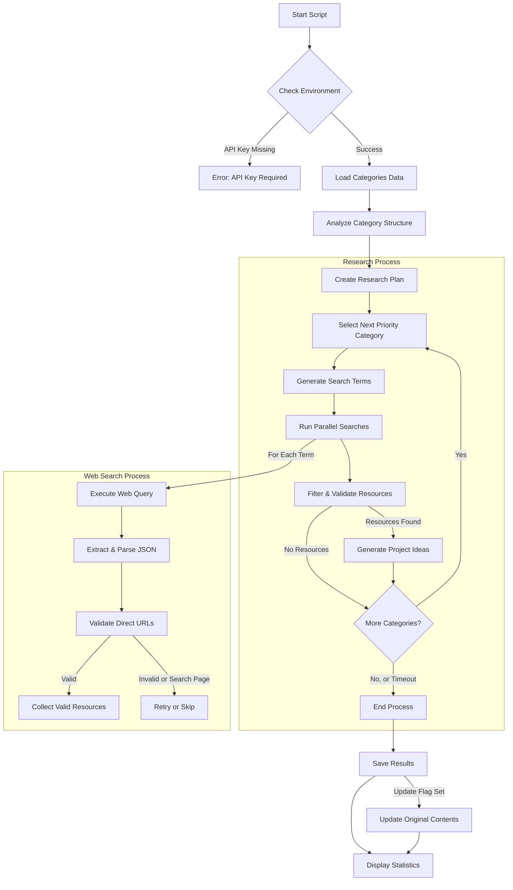

# Awesome Video Researcher

A powerful tool leveraging the OpenAI Agents SDK to discover high-quality resources and generate creative project ideas for video creation and editing.

## Table of Contents

- [Overview](#overview)
- [Installation](#installation)
- [Key Components](#key-components)
- [Usage Examples](#usage-examples)
- [Command Line Arguments](#command-line-arguments)
- [System Flow](#system-flow)
- [Output Structure](#output-structure)
- [Recent Results](#recent-results)
- [Technical Architecture](#technical-architecture)
- [Customizing the Research Process](#customizing-the-research-process)
- [Troubleshooting](#troubleshooting)
- [Extending the Tool](#extending-the-tool)

## Overview

The Awesome Video Researcher tool uses the OpenAI Agents SDK to research and discover valuable resources related to video creation and editing technologies. It employs a multi-agent system featuring specialized agents for planning research, conducting web searches, and generating creative project ideas based on discovered resources.

The tool analyzes a structured JSON collection of video-related categories, creates a research plan, searches for high-quality resources across the web, and generates innovative project ideas based on the discovered resources.

## Installation

### Prerequisites

- Python 3.9+
- OpenAI API key with access to GPT-4 models
- Web search access for the API key

### Setup

1. Clone this repository:
   ```bash
   git clone https://github.com/yourusername/awesome-video.git
   cd awesome-video
   ```

2. Install the required packages:
   ```bash
   pip install openai-agents requests
   ```

3. Set your OpenAI API key:
   ```bash
   export OPENAI_API_KEY=your_api_key_here
   ```

## Key Components

The tool consists of several key components:

### 1. Agent System Architecture

The research process is handled by a multi-agent system with three specialized agents:

- **PlannerAgent**: Creates a structured research plan by analyzing the category structure and identifying priority categories.
- **SearchAgent**: Searches for specific resources across the web, ensuring they're high-quality and relevant.
- **WriterAgent**: Generates creative project ideas based on existing and newly discovered resources.

### 2. ResearchManager

The `ResearchManager` class coordinates the entire research process:
- Planning the search approach
- Executing parallel searches
- Filtering and validating resources
- Generating project ideas
- Saving results

### 3. Category Analysis

The tool analyzes the hierarchical category structure to understand relationships between categories and better target the search process.

### 4. Validation and Filtering

Robust validation of search results ensures only high-quality, direct resources (not search pages) are included in the final output.

## Usage Examples

### Basic Usage

Run a basic research process with default settings:

```bash
python3 av-researcher-agents.py
```

This will:
- Load the default contents file from the remote URL
- Find at least 10 resources per category
- Allow 5 minutes (300s) per category
- Set a global timeout of 4 hours
- Run system checks to verify the environment

### Quick Research with Minimal Results

For a faster run that focuses on finding just a few resources per category:

```bash
python3 av-researcher-agents.py --min-results 2 --time-limit 120 --skip-checks
```

This will:
- Find at least 2 resources per category
- Limit each category to 2 minutes (120s)
- Skip the initial system checks to start faster

### Comprehensive Research with Randomized Order

For a more thorough research approach with randomized category order:

```bash
python3 av-researcher-agents.py --min-results 15 --time-limit 600 --randomize --global-timeout 28800
```

This will:
- Find at least 15 resources per category
- Allow 10 minutes (600s) per category
- Randomize the order of categories researched
- Set a global timeout of 8 hours (28800s)

### Debugging Mode

For debugging issues or understanding the internal processes better:

```bash
python3 av-researcher-agents.py --debug --log-file debug.log
```

This will:
- Enable detailed debug logging
- Save logs to debug.log instead of the default research.log

## Command Line Arguments

| Argument | Description | Default | Example |
|----------|-------------|---------|---------|
| `--contents-file` | Path to contents JSON file or URL | Remote URL | `--contents-file local_data.json` |
| `--update` | Update the original contents with new findings | False | `--update` |
| `--output` | Path to save the output | Same as input | `--output new_data.json` |
| `--debug` | Enable debug logging | False | `--debug` |
| `--log-file` | Path to the log file | research.log | `--log-file custom.log` |
| `--min-results` | Minimum number of results to find per category | 10 | `--min-results 5` |
| `--time-limit` | Maximum time in seconds per category | 300 | `--time-limit 120` |
| `--global-timeout` | Maximum time in seconds for the entire script | 14400 (4 hours) | `--global-timeout 7200` |
| `--randomize` | Randomize the order of categories | False | `--randomize` |
| `--random-seed` | Random seed for reproducible randomization | None | `--random-seed 42` |
| `--skip-checks` | Skip system checks | False | `--skip-checks` |

## System Flow

The following diagram illustrates the research process flow:



## Output Structure

The research process produces two main outputs:

### 1. `new_projects.json`

Contains all discovered resources and generated project ideas. Structure:

```json
{
  "new_resources": [
    {
      "title": "Resource Title",
      "description": "Detailed resource description",
      "url": "https://example.com/specific-resource",
      "category": "category-id",
      "tags": ["tag1", "tag2", "tag3"]
    },
    ...
  ],
  "new_project_ideas": [
    {
      "title": "Project Idea Title",
      "description": "Detailed project description",
      "category": "category-id",
      "tags": ["tag1", "tag2", "tag3"]
    },
    ...
  ],
  "timestamp": "ISO datetime",
  "stats": {
    "resources_count": 120,
    "project_ideas_count": 30,
    "resources_by_category": {...},
    "ideas_by_category": {...}
  }
}
```

### 2. Intermediate Results

During execution, the tool saves intermediate results in files named `intermediate_results_[timestamp].json` with the same structure as the final output.

## Recent Results

A recent run of the tool demonstrates its effectiveness in finding high-quality resources and generating project ideas. The script was executed with the following command:

```bash
python3 av-researcher-agents.py --min-results 2 --time-limit 120 --skip-checks --debug --global-timeout 600
```

### Performance Summary

- **Total Execution Time**: 329.42 seconds (5.5 minutes)
- **Resources Found**: 120 resources across 10 categories
- **Project Ideas Generated**: 30 project ideas (3 per category)
- **Success Rate**: 100% of categories yielded high-quality resources

### Resources Distribution

| Category | Resources Found |
|----------|----------------|
| learning-resources | 15 |
| tutorials-case-studies | 11 |
| adaptive-streaming | 11 |
| hls | 13 |
| ffmpeg | 12 |
| hevc | 11 |
| mobile-web-players | 11 |
| quality-testing | 11 |
| hdr-guidelines | 11 |
| cloud-platforms | 14 |

### Sample Resources

Here are a few examples of the high-quality resources discovered:

1. **Quality Testing Category**:
   - VQmon® - Embedded Device Analytics™ for Data, Voice and Video (https://www.telchemy.com/vqmon.php)
   - SSIMplus Video Quality-of-Experience Assessment (https://ece.uwaterloo.ca/~z70wang/research/ssimplus/)

2. **Cloud Platforms Category**:
   - Blackbird Video: Cloud Video Editing Platform (https://www.blackbird.video/cloud-video-editing/)
   - VEED.IO: Cloud Video Editing and Collaboration (https://www.veed.io/tools/video-collaboration/cloud-video-editing)

### Sample Project Ideas

The tool generated innovative project ideas for each category:

1. **Cloud Platforms Category**:
   - "AI-Powered Cloud Editing for Live Sports and Esports Streaming"
   - "Virtual Cloud Workstations for Collaborative Video Production"
   - "Streamlined Cloud Workflow for Interactive Video Effects"

2. **HDR Guidelines Category**:
   - "Interactive HDR Workflow Simulator"
   - "HDR Tech Deep Dive: Analyzing Standards and Formats"

### Viewing the Results

To explore the full results:

```bash
# View the results summary
cat new_projects.json | jq '.stats'

# List all resources for a specific category
cat new_projects.json | jq '.new_resources[] | select(.category=="quality-testing")'

# Browse all project ideas
cat new_projects.json | jq '.new_project_ideas[] | {title, category}'
```

## Technical Architecture

This section provides a detailed overview of the code structure and implementation for developers who want to understand or extend the tool.

### Code Organization

The script is organized into several functional sections:

```
av-researcher-agents.py
├── Imports and Configuration
├── Schema Definitions (Resource and Project Idea validation)
├── Utility Functions (logging, file handling)
├── Data Loading and Analysis
├── Agent Classes
│   ├── PlannerAgent
│   ├── SearchAgent
│   ├── WriterAgent
├── ResearchManager
├── System Checks
├── Result Management
└── Main Function
```

### Key Classes

#### 1. Agent Classes

The tool uses three specialized agent classes that leverage the OpenAI Agents SDK:

```python
class PlannerAgent:
    """Agent that creates research plans and coordinates the research process."""

    def __init__(self):
        self.agent = Agent(
            name="Research Planner",
            instructions="...",  # Specialized instructions
        )

    async def create_plan(self, contents_data):
        # Analyzes content structure and creates a research plan
        # Returns a structured plan with priority categories and search terms
```

```python
class SearchAgent:
    """Agent that searches for resources using web search capabilities."""

    def __init__(self):
        self.agent = Agent(
            name="Resource Searcher",
            instructions="...",  # Specialized instructions for finding resources
            tools=[WebSearchTool()]  # Uses the web search tool from OpenAI
        )

    async def search(self, search_term, category, timeout=60, max_retries=3):
        # Executes searches with retries and validation
        # Returns a list of validated resources
```

```python
class WriterAgent:
    """Agent that generates project ideas based on resources."""

    def __init__(self):
        self.agent = Agent(
            name="Project Idea Generator",
            instructions="...",  # Specialized instructions for idea generation
        )

    async def generate_ideas(self, category, existing_data, new_resources):
        # Creates project ideas based on existing and new resources
        # Returns a list of creative project ideas
```

#### 2. ResearchManager Class

The `ResearchManager` orchestrates the entire research process:

```python
class ResearchManager:
    """Manager that coordinates the research process between agents."""

    def __init__(self):
        self.planner_agent = PlannerAgent()
        self.search_agent = SearchAgent()
        self.writer_agent = WriterAgent()

    async def run(self, contents_data, min_results=10, time_limit=300, global_timeout=14400, randomize=False, random_seed=None):
        # Main execution loop
        # Coordinates the complete research process
```

Key methods in the `ResearchManager` include:

- `_plan_searches`: Creates a research plan using the planner agent
- `_perform_searches`: Executes parallel searches for a category
- `_search`: Performs a single search for a specific term
- `_generate_ideas`: Creates project ideas for a category

### Asynchronous Execution

The tool uses Python's `asyncio` library for asynchronous execution, allowing it to run searches in parallel and implement timeouts:

```python
# Run searches in parallel with overall time limit
remaining_time = max(5, time_limit - (time.time() - start_time))
results = await asyncio.wait_for(
    asyncio.gather(*search_tasks, return_exceptions=True),
    timeout=remaining_time
)
```

### Result Validation

A critical aspect of the tool is its validation of search results to ensure only high-quality resources are included:

```python
# Filter out search links and other invalid resources
valid_resources = []
for resource in resources:
    url = resource.get("url", "").lower()

    # Skip generic search results
    if "google.com/search" in url or "youtube.com/results" in url:
        logging.warning(f"Skipping search result URL: {url}")
        continue

    # Ensure URL seems legitimate
    if url.startswith(("http://", "https://")) and "." in url:
        valid_resources.append(resource)
    else:
        logging.warning(f"Invalid URL format: {url}")
```

### Error Handling and Retries

The tool implements robust error handling with retry mechanisms for searches:

```python
for attempt in range(1, max_retries + 1):
    try:
        # Search attempt implementation
    except Exception as e:
        logging.error(f"Error in search attempt {attempt}: {e}")
        if attempt < max_retries:
            await asyncio.sleep(2)  # Small delay before retry
```

### JSON Parsing and Extraction

Since the responses from the agents are in natural language with embedded JSON, the tool uses regex pattern matching to extract the JSON:

```python
# Look for array pattern if needed
if not json_text.strip().startswith('['):
    import re
    json_pattern = r'(\[[\s\S]*\])'
    matches = re.search(json_pattern, json_text)
    if matches:
        json_text = matches.group(1)
```

## Customizing the Research Process

### Adjusting Search Depth

Control how many resources to find per category using the `--min-results` flag:
- Lower values (1-3): Quick research, focusing on a few key resources
- Medium values (5-10): Balanced research depth
- Higher values (15+): Comprehensive research

### Time Management

Balance thoroughness with time constraints:
- `--time-limit`: Time per category (seconds)
- `--global-timeout`: Overall time limit (seconds)

For example, for a quick 30-minute run with 2 minutes per category:
```bash
python3 av-researcher-agents.py --min-results 3 --time-limit 120 --global-timeout 1800
```

### Category Prioritization

The tool automatically prioritizes categories, but you can influence this:
- `--randomize`: Explore categories in random order
- `--random-seed`: Ensure reproducible randomization

## Troubleshooting

### API Key Issues

If you encounter errors about the OpenAI API key:
- Verify the key is set: `echo $OPENAI_API_KEY`
- Check if the key has web search access
- Ensure the key is valid and not expired

### Web Search Not Working

If web searches fail to return direct resources:
- Enable debug mode: `--debug`
- Check if search quota is exhausted
- Verify internet connectivity

### Performance Issues

If the script is running slowly:
- Reduce `--min-results` and `--time-limit`
- Focus on fewer categories by creating a custom contents file
- Run with `--skip-checks` to bypass initial verification

## Extending the Tool

### Custom Category Data

You can create your own category data file with the following structure:

```json
{
  "categories": ["category1", "category2", ...],
  "category1": [
    {
      "title": "Existing Resource",
      "description": "Description",
      "homepage": "https://example.com",
      "tags": ["tag1", "tag2"]
    },
    ...
  ],
  "category2": [
    ...
  ]
}
```

### Modifying Agent Prompts

To customize how agents operate, you can edit their instructions in the script:
- `PlannerAgent`: Modify research planning strategy
- `SearchAgent`: Adjust resource search criteria
- `WriterAgent`: Change project idea generation approach
