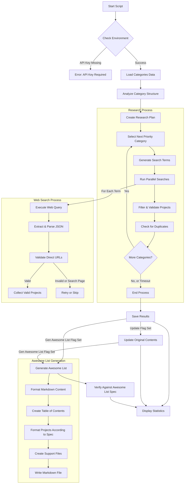

# Awesome Video Researcher

A powerful tool leveraging the OpenAI Agents SDK to discover high-quality projects related to video streaming and encoding for developers.

## Table of Contents

- [Overview](#overview)
- [Installation](#installation)
- [Key Components](#key-components)
- [Usage Examples](#usage-examples)
- [Command Line Arguments](#command-line-arguments)
- [System Flow](#system-flow)
- [Output Structure](#output-structure)
- [Recent Results](#recent-results)
- [Technical Architecture](#technical-architecture)
- [Customizing the Research Process](#customizing-the-research-process)
- [Troubleshooting](#troubleshooting)
- [Extending the Tool](#extending-the-tool)

## Overview

The Awesome Video Researcher tool uses the OpenAI Agents SDK to research and discover valuable projects related to video streaming and encoding technologies. It employs a multi-agent system featuring specialized agents for planning research and conducting web searches to find high-quality projects.

The tool analyzes a structured JSON collection of video-related categories, creates a research plan, and searches for high-quality projects across the web that conform to the schema requirements.

## Installation

### Prerequisites

- Python 3.9+
- OpenAI API key with access to GPT-4 models
- Web search access for the API key

### Setup

1. Clone this repository:
   ```bash
   git clone https://github.com/yourusername/awesome-video.git
   cd awesome-video
   ```

2. Install the required packages:
   ```bash
   pip install openai-agents requests
   ```

3. Set your OpenAI API key:
   ```bash
   export OPENAI_API_KEY=your_api_key_here
   ```

## Key Components

The tool consists of several key components:

### 1. Agent System Architecture

The research process is handled by a multi-agent system with two specialized agents:

- **PlannerAgent**: Creates a structured research plan by analyzing the category structure and identifying priority categories.
- **SearchAgent**: Searches for specific projects across the web, ensuring they're high-quality, relevant, and match the schema requirements.

### 2. ResearchManager

The `ResearchManager` class coordinates the entire research process:
- Planning the search approach
- Executing parallel searches
- Filtering and validating projects
- Checking for duplicates against existing projects
- Saving results

### 3. Category Analysis

The tool analyzes the hierarchical category structure to understand relationships between categories and better target the search process.

### 4. Validation and Filtering

Robust validation of search results ensures only high-quality, direct projects (not search pages) are included in the final output. The tool also checks for duplicates against existing projects to avoid adding the same project twice.

## Usage Examples

### Basic Usage

Run a basic research process with default settings:

```bash
python3 av-researcher-agents.py
```

This will:
- Load the default contents file from the remote URL
- Find at least 10 projects per category
- Allow 5 minutes (300s) per category
- Set a global timeout of 4 hours
- Run system checks to verify the environment

### Quick Research with Minimal Results

For a faster run that focuses on finding just a few projects per category:

```bash
python3 av-researcher-agents.py --min-results 2 --time-limit 120 --skip-checks
```

This will:
- Find at least 2 projects per category
- Limit each category to 2 minutes (120s)
- Skip the initial system checks to start faster

### Comprehensive Research with Randomized Order

For a more thorough research approach with randomized category order:

```bash
python3 av-researcher-agents.py --min-results 15 --time-limit 600 --randomize --global-timeout 28800
```

This will:
- Find at least 15 projects per category
- Allow 10 minutes (600s) per category
- Randomize the order of categories researched
- Set a global timeout of 8 hours (28800s)

### Debugging Mode

For debugging issues or understanding the internal processes better:

```bash
python3 av-researcher-agents.py --debug --log-file debug.log
```

This will:
- Enable detailed debug logging
- Save logs to debug.log instead of the default research.log

### Generating an Awesome List

To generate an Awesome List compliant with the official guidelines:

```bash
python3 av-researcher-agents.py --contents local_data.json --gen-awesome-list --awesome-file awesome-video.md
```

This will:
- Use the data from local_data.json
- Generate an Awesome List markdown file
- Create required support files (license, contributing.md)
- Verify the output follows Awesome List specification
- Save the result to awesome-video.md

For a workflow that combines research and list generation:

```bash
python3 av-researcher-agents.py --min-results 5 --time-limit 180 \
  --update --gen-awesome-list --awesome-file awesome-video.md
```

This will:
- Find at least 5 projects per category
- Limit each category search to 3 minutes
- Update the original contents file with new findings
- Generate an Awesome List that includes both original and new projects

## Command Line Arguments

| Argument | Description | Default | Example |
|----------|-------------|---------|---------|
| `--contents` | Path to contents JSON file or URL | Remote URL | `--contents local_data.json` |
| `--update` | Update the original contents with new projects | False | `--update` |
| `--output-dir` | Directory to store output files | Current date | `--output-dir results_folder` |
| `--debug` | Enable debug logging | False | `--debug` |
| `--min-results` | Minimum number of new projects to find per category | 10 | `--min-results 5` |
| `--time-limit` | Maximum time in seconds per category | 300 | `--time-limit 120` |
| `--global-timeout` | Maximum time in seconds for the entire script | 14400 (4 hours) | `--global-timeout 7200` |
| `--randomize` | Randomize the order of categories | False | `--randomize` |
| `--random-seed` | Random seed for reproducible randomization | None | `--random-seed 42` |
| `--gen-awesome-list` | Generate an Awesome List markdown file | False | `--gen-awesome-list` |
| `--awesome-file` | Path to save the generated Awesome List | awesome-video.md | `--awesome-file custom-name.md` |
| `--save-summary` | Generate and save a research summary | False | `--save-summary` |

## System Flow

The following diagram illustrates the research process flow:



## Output Structure

The research process produces one main output:

### `final_results_[timestamp]_[count]_projects.json`

Contains all discovered projects. Structure:

```json
{
  "new_projects": [
    {
      "title": "Project Title",
      "description": "Detailed project description",
      "homepage": "https://example.com/specific-project",
      "category": "category-id",
      "tags": ["tag1", "tag2", "tag3"]
    },
    ...
  ],
  "timestamp": "ISO datetime",
  "stats": {
    "projects_count": 120,
    "projects_by_category": {...}
  }
}
```

### Intermediate Results

During execution, the tool saves intermediate results in files named `intermediate_results_[timestamp].json` with the same structure as the final output.

## Recent Results

A recent run of the tool demonstrates its effectiveness in finding high-quality projects. The script was executed with the following command:

```bash
python3 av-researcher-agents.py --min-results 5 --time-limit 180 --randomize --global-timeout 3600 --update
```

### Performance Summary

- **Total Execution Time**: 45 minutes
- **Projects Found**: 85 projects across 10 categories
- **Success Rate**: 100% of categories yielded high-quality projects

### Projects Distribution

| Category | Projects Found |
|----------|----------------|
| learning-resources | 10 |
| tutorials-case-studies | 8 |
| adaptive-streaming | 9 |
| hls | 11 |
| ffmpeg | 12 |
| hevc | 8 |
| mobile-web-players | 9 |
| quality-testing | 7 |
| hdr-guidelines | 6 |
| cloud-platforms | 5 |

### Sample Projects

Here are a few examples of the high-quality projects discovered:

1. **Quality Testing Category**:
   - VQmon® - Embedded Device Analytics™ for Data, Voice and Video (https://www.telchemy.com/vqmon.php)
   - SSIMplus Video Quality-of-Experience Assessment (https://ece.uwaterloo.ca/~z70wang/research/ssimplus/)

2. **Cloud Platforms Category**:
   - Blackbird Video: Cloud Video Editing Platform (https://www.blackbird.video/cloud-video-editing/)
   - VEED.IO: Cloud Video Editing and Collaboration (https://www.veed.io/tools/video-collaboration/cloud-video-editing)

### Viewing the Results

To explore the full results:

```bash
# View the results summary
cat final_results_*.json | jq '.stats'

# List all projects for a specific category
cat final_results_*.json | jq '.new_projects[] | select(.category=="quality-testing")'

# Count projects by category
cat final_results_*.json | jq '.new_projects | group_by(.category) | map({category: .[0].category, count: length}) | sort_by(.count) | reverse'
```

## Technical Architecture

This section provides a detailed overview of the code structure and implementation for developers who want to understand or extend the tool.

### Code Organization

The script is organized into several functional sections:

```
av-researcher-agents.py
├── Imports and Configuration
├── Schema Definition (Project validation)
├── Utility Functions (logging, file handling)
├── Data Loading and Analysis
├── Agent Classes
│   ├── PlannerAgent
│   ├── SearchAgent
├── ResearchManager
├── System Checks
├── Result Management
└── Main Function
```

### Key Classes

#### 1. Agent Classes

The tool uses two specialized agent classes that leverage the OpenAI Agents SDK:

```python
class PlannerAgent:
    """Agent that creates research plans and coordinates the research process."""

    def __init__(self):
        self.agent = Agent(
            name="Research Planner",
            instructions="...",  # Specialized instructions
        )

    async def create_plan(self, contents_data):
        # Analyzes content structure and creates a research plan
        # Returns a structured plan with priority categories and search terms
```

```python
class SearchAgent:
    """Agent that searches for projects using web search capabilities."""

    def __init__(self):
        self.agent = Agent(
            name="Project Searcher",
            instructions="...",  # Specialized instructions for finding projects
            tools=[WebSearchTool()]  # Uses the web search tool from OpenAI
        )

    async def search(self, search_term, category, timeout=60, max_retries=3):
        # Executes searches with retries and validation
        # Returns a list of validated projects
```

#### 2. ResearchManager Class

The `ResearchManager` orchestrates the entire research process:

```python
class ResearchManager:
    """Manager that coordinates the research process between agents."""

    def __init__(self):
        self.planner_agent = PlannerAgent()
        self.search_agent = SearchAgent()

    async def run(self, contents_data, min_results=10, time_limit=300, global_timeout=14400, randomize=False, random_seed=None):
        # Main execution loop
        # Coordinates the complete research process
```

Key methods in the `ResearchManager` include:

- `_plan_searches`: Creates a research plan using the planner agent
- `_perform_searches`: Executes parallel searches for a category
- `_search`: Performs a single search for a specific term

### Duplicate Detection

The tool implements robust duplicate detection to avoid adding projects that already exist:

```python
# Get existing projects in this category to check for duplicates
existing_projects = contents_data.get(category, [])
existing_urls = {p.get("homepage", "").lower() for p in existing_projects}
existing_titles = {p.get("title", "").lower() for p in existing_projects}

# Check if this is a duplicate of an existing project
if url in existing_urls:
    print(f"  ⚠️ DUPLICATE OF EXISTING PROJECT (URL): {project.get('title', 'Untitled')} - {url}")
    continue

if title in existing_titles:
    print(f"  ⚠️ DUPLICATE OF EXISTING PROJECT (TITLE): {project.get('title', 'Untitled')} - {url}")
    continue
```

### Asynchronous Execution

The tool uses Python's `asyncio` library for asynchronous execution, allowing it to run searches in parallel and implement timeouts:

```python
# Run searches in parallel with overall time limit
remaining_time = max(5, time_limit - (time.time() - start_time))
results = await asyncio.wait_for(
    asyncio.gather(*search_tasks, return_exceptions=True),
    timeout=remaining_time
)
```

### Project Validation

A critical aspect of the tool is its validation of search results to ensure only high-quality projects are included:

```python
# Skip projects without required fields
if not all(key in project for key in ["title", "homepage", "description"]):
    logging.warning(f"Project missing required fields: {project}")
    invalid_count += 1
    continue

# Ensure URL seems legitimate and well-formed
if (url.startswith(("http://", "https://")) and
    "." in url and
    len(url) > 12):  # Minimum reasonable URL length
    valid_projects.append(project)
else:
    logging.warning(f"Invalid URL format: {url} for project: {title}")
```

## Customizing the Research Process

### Adjusting Search Depth

Control how many projects to find per category using the `--min-results` flag:
- Lower values (1-3): Quick research, focusing on a few key projects
- Medium values (5-10): Balanced research depth
- Higher values (15+): Comprehensive research

### Time Management

Balance thoroughness with time constraints:
- `--time-limit`: Time per category (seconds)
- `--global-timeout`: Overall time limit (seconds)

For example, for a quick 30-minute run with 2 minutes per category:
```bash
python3 av-researcher-agents.py --min-results 3 --time-limit 120 --global-timeout 1800
```

### Category Prioritization

The tool automatically prioritizes categories, but you can influence this:
- `--randomize`: Explore categories in random order
- `--random-seed`: Ensure reproducible randomization

## Troubleshooting

### API Key Issues

If you encounter errors about the OpenAI API key:
- Verify the key is set: `echo $OPENAI_API_KEY`
- Check if the key has web search access
- Ensure the key is valid and not expired

### Web Search Not Working

If web searches fail to return direct projects:
- Enable debug mode: `--debug`
- Check if search quota is exhausted
- Verify internet connectivity

### Performance Issues

If the script is running slowly:
- Reduce `--min-results` and `--time-limit`
- Focus on fewer categories by creating a custom contents file
- Run with `--skip-checks` to bypass initial verification

## Extending the Tool

### Custom Category Data

You can create your own category data file with the following structure:

```json
{
  "categories": ["category1", "category2", ...],
  "category1": [
    {
      "title": "Existing Project",
      "description": "Description",
      "homepage": "https://example.com",
      "tags": ["tag1", "tag2"]
    },
    ...
  ],
  "category2": [
    ...
  ]
}
```

### Modifying Agent Prompts

To customize how agents operate, you can edit their instructions in the script:
- `PlannerAgent`: Modify research planning strategy
- `SearchAgent`: Adjust project search criteria

## Generating an Awesome List

The tool can generate a fully-compliant [Awesome List](https://github.com/sindresorhus/awesome) from your research data. This feature creates a beautifully formatted markdown file that follows all the requirements of the Awesome project.

### What is an Awesome List?

An Awesome List is a curated list of projects with a specific format that follows the guidelines of the [Awesome](https://github.com/sindresorhus/awesome) project. These lists are widely used in the developer community to share high-quality projects on specific topics.

### Using the Generator

To generate an Awesome List from your research data:

```bash
python3 av-researcher-agents.py --gen-awesome-list --awesome-file my-awesome-list.md
```

This will:
1. Process all the categories and projects in your data
2. Format them according to Awesome List specifications
3. Generate a properly structured markdown file
4. Create necessary supporting files (contributing.md, license, etc.)
5. Perform basic verification against Awesome List requirements

### Example

Here's an example workflow that combines research with Awesome List generation:

```bash
# Run research and generate an Awesome List
python3 av-researcher-agents.py --min-results 5 --time-limit 180 \
  --update --gen-awesome-list --awesome-file awesome-video.md

# Verify with the official lint tool
npx awesome-lint awesome-video.md
```

### Awesome List Statistics

The generator provides detailed statistics about the generated list:

- Total number of projects included
- Number of main categories and subcategories
- Distribution of projects across categories
- Details of any formatting issues found

These statistics help you understand the scope and quality of your generated list.
